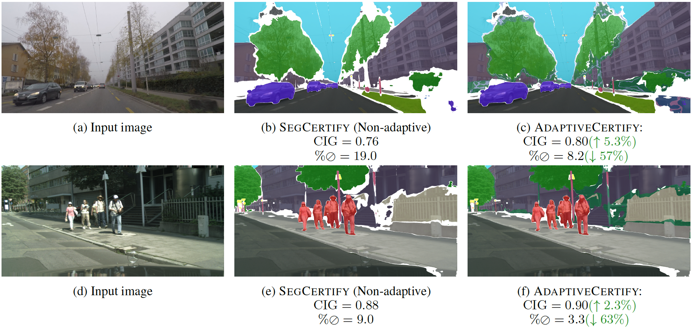

# AdaptiveCertify: Adaptive Hierarchical Certification for Segmentation using Randomized Smoothing
## Abstract
Common certification methods operate on a flat pre-defined set of fine-grained classes. In this paper, however, we propose a novel, more general, and practical setting, namely adaptive hierarchical certification for image semantic segmentation. In this setting, the certification can be within a multi-level hierarchical label space composed of fine to coarse levels. Unlike classic methods where the certification would abstain for unstable components, our approach adaptively relaxes the certification to a coarser level within the hierarchy. This relaxation lowers the abstain rate whilst providing more certified semantically meaningful information. We mathematically formulate the problem setup and introduce, for the first time, an adaptive hierarchical certification algorithm for image semantic segmentation, that certifies image pixels within a hierarchy and prove the correctness of its guarantees. Since certified accuracy does not take the loss of information into account when traversing into a coarser hierarchy level, we introduce a novel evaluation paradigm for adaptive hierarchical certification, namely the certified information gain metric, which is proportional to the class granularity level. Our extensive evaluation experiments on real-world challenging datasets such as Cityscapes, ACDC, PASCAL-Context, and COCO-Stuff-10K demonstrate that our adaptive algorithm achieves a higher certified information gain and a lower abstain rate compared to the current state-of-the-art certification method, as well as other non-adaptive versions of it.

<figure>
  
  <figcaption>The certified segmentation outputs on input images (a) and (d) from SegCertify in (b) and (e), and AdaptiveCertify in (c) and (f) with their corresponding certified information gain (CIG) and abstain rate. Our method provides more meaningful certified output in pixels the state-of-the-art abstains from (white pixels), with a much lower abstain rate, and higher certified information gain.</figcaption>
</figure>

## Installation
Clone the repository:
```
git clone --recurse-submodules https://github.com/AlaaAnani/adaptive-certify.git
cd adaptive-certify/
```
Setup the environment by running the following:

```
conda create -n cert python=3.8
conda activate cert
```
Install PyTorch. We used pytorch==1.7.1:
```
conda install pytorch==1.7.1 torchvision==0.8.2 torchaudio==0.7.2 cudatoolkit=11.0 -c pytorch
```
Install the rest of the libraries
```
pip install -r requirements.txt
```
## Datasets Preperation
We place the datasets in the following directory format under `HRNet-Semantic-Segmentation/`:
```
HRNet-Semantic-Segmentation
├── data
│   ├── acdc
│   │   ├── gt
│   │   ├── rgb_anon
│   ├── cityscapes
│   │   ├── gtFine
│   │   ├── leftImg8bit
│   ├── cocostuff
│   │   ├── cocostuff-10k-v1.1.json
│   │   ├── train
│   │   └── val
│   └── pascal_ctx
│   |   ├── trainval
│   |   └── VOCdevkit
│   ├── list
│   │   ├── acdc
│   │   ├── ade20k
│   │   ├── cityscapes
│   │   └── cocostuff

```
### Hierarchies
We already upload our pre-defined hierarchies JSONs in `configs/<dataset>/<dataset>_hierarchy.json`. 

However, if you would like to create them from scratch, we also provide the script for this under `annotations/<dataset>.py`

For example, to create the hierarchy JSON for Cityscapes, run the following:
```
python annotations/cityscapes.py
```
which will create `configs/cityscapes/cityscapes_hierarchy.json`.

Feel free to experiment with different hierarchy DAG structures on top every dataset fine-grained classes in level 0. To do so, change the nodes arrangement in a dataset's script `annotations/<dataset>.py`.

### Cityscapes
We downloaded the dataset from the [official Cityscapes dataset website](https://www.cityscapes-dataset.com/downloads/).
### ACDC
We downloaded the dataset from the [official ACDC dataset website](https://acdc.vision.ee.ethz.ch/download)
### PASCAL-Context
We followed the [mmsegmentation instructions](https://github.com/open-mmlab/mmsegmentation/blob/master/docs/en/dataset_prepare.md#pascal-context) to download the dataset API and do the conversions.
### COCO-Stuff-10K
We followed the [mmsegmentation instructions](https://github.com/open-mmlab/mmsegmentation/blob/master/docs/en/dataset_prepare.md#coco-stuff-10k) to download the dataset and run the necessary label conversions.
# Model Weights
### Cityscapes, ACDC, PASCAL-Context:
For models trained on Cityscapes and PASCAL-Context with a noise of $\sigma=0.25$, we use the weights provided by the repository [segmentation-smoothing](https://github.com/eth-sri/segmentation-smoothing/tree/main/code)


### COCO-Stuff-10K: 
#### Training 
To train HrNetV2 on COCO-Stuff-10K with a noise of $\sigma=0.25$, run the following:
```
python -m torch.distributed.launch --nproc_per_node=1 tools/train.py --cfg experiments/cocostuff/seg_hrnet_ocr_adv025_3965_alt_w48_520x520_ohem_sgd_lr1e-3_wd1e-4_bs_16_epoch110_paddle.yaml
```
### Download all model weights

Alternatively, download all the needed weights from GDrive [here](https://drive.google.com/drive/folders/1MiciR1oJJaSYb4EDTKn207YYsww7Luo_?usp=sharing).

The pretrained_models directory under `HRNet-Semantic-Segmentation/` should look like this:
```
HRNet-Semantic-Segmentation/
├── pretrained_models
│   ├── cityscapes.pth
│   ├── cocostuff10k_025.pth
│   ├── hrnetv2_w48_imagenet_pretrained.pth
│   ├── HRNet_W48_C_ssld_pretrained.pth
│   └── pascal.pth
```
## Run Certification
### Sigma inference
To run certification on AdaptiveCertify, and also the baseline SegCertify:
```
python tools/test_adaptivecert.py --cfg configs/cityscapes/cityscapes.yaml --exp inference
```
Possible values for cfg depending on the datasets are:
- 'configs/cocostuff10k/cocostuff10k.yaml'
- 'configs/pascal_ctx/pascal_ctx.yaml'
- 'configs/acdc/acdc.yaml'
- 'configs/cityscapes/cityscapes.yaml'
### Experiments replication
To replicate the experiment figures we have in the paper, you can assign to --exp either of these values: `['inference', 'table', 'distribution', 'images', 'fluctuations', 'find_best_threshold']`

To graph out the logged outputs, use the IPYNB Notebooks we have in `experiments/`.
